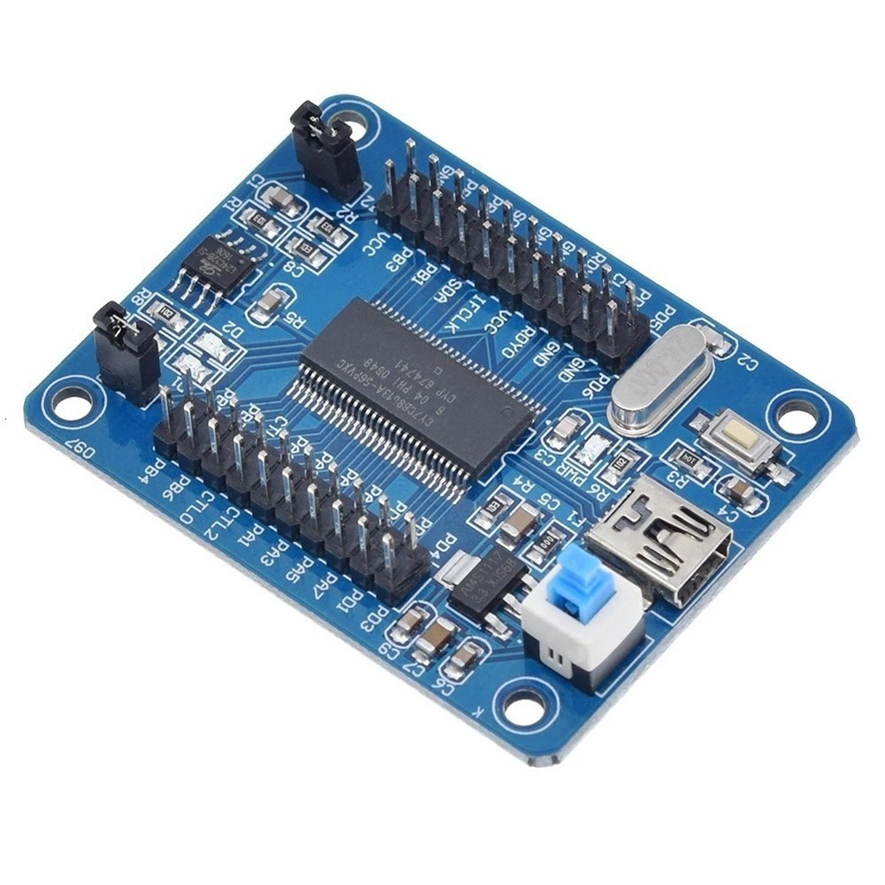

# EZ-USB-FX2LP

## Some experiments with Cypress EX-USB FX2LP Keil firmware, python computer code, to test usb transfers from micro to pc and reverse. 

You need [dd](https://github.com/bigjohnson/WaybackMachine/raw/refs/heads/main/Cypress/CySuiteUSB_3_4_7_B204.exe) Cypress USB FX2LP development package.
